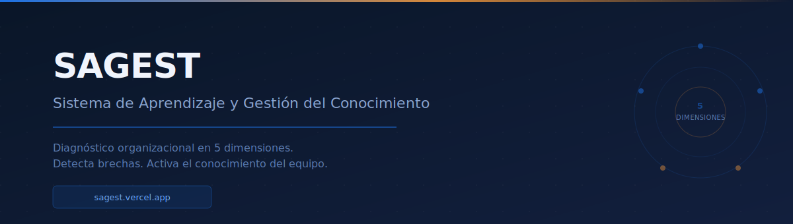
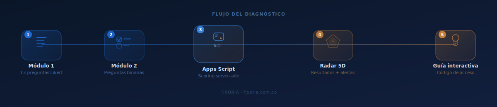



# SAGEST — Organizational Learning Diagnostic

Knowledge management assessment tool for restaurant teams. Measures how knowledge **flows** within the operation: whether it is created, retained, shared and applied — not satisfaction or performance.

---

## What it measures

Five dimensions across two modules (~15 min):

| Dimension | Focus |
|---|---|
| D1 Organizational Learning | Team capacity to learn from daily operations |
| D2 Knowledge Management | How know-how is captured and distributed |
| D3 Human Capital | Skills, training and staff turnover |
| D4 Organizational Culture | Openness to change, internal communication |
| D5 Organizational Performance | Measurable operational results |

Participants receive a **5-dimension gap radar** with prioritized recommendations per dimension and an access code to their personalized interactive guide.

---

## Flow

Module 1 (Likert scale) > Module 2 (binary questions) > server-side scoring > 5D radar + alerts > access code > interactive guide.

---

## Access

| Page | URL |
|---|---|
| Diagnostic | [sagest.vercel.app](https://sagest.vercel.app) |
| Interactive guide | [sagest.vercel.app/guia.html](https://sagest.vercel.app/guia.html) |
| Technical annex | [sagest.vercel.app/arquitectura](https://sagest.vercel.app/arquitectura) |

The facilitator dashboard requires access credentials.

---

## Stack

HTML5 · CSS3 · vanilla JavaScript · Chart.js 4.4 · Google Apps Script · Google Sheets · Vercel

Typography: DM Sans, DM Serif Display, JetBrains Mono

---

*Designed for Spanish-speaking teams in Colombia. Interface and reports are in Spanish.*